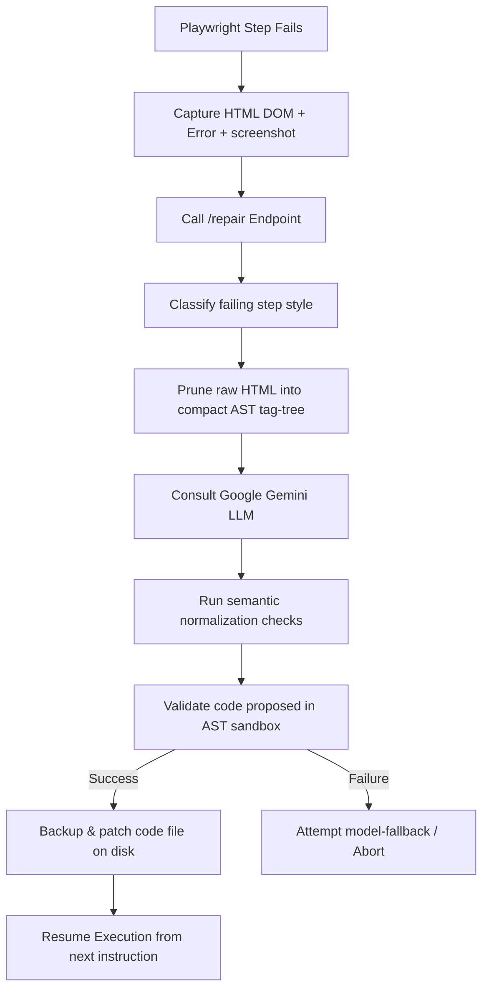

# Playwright Executor + Step Repair Engine

> **Created by:** Mokshith Balidi  
> **Created in:** January 2026  
> **Organization:** TW.2324  
> **Rights:** Mokshith Balidi holds all rights to this microservice.

---

A production-grade, AI-driven self-healing automation microservice designed to intercept Playwright test failures, diagnose locator/interruption issues using Google Gemini, validate code modifications in a secure AST-audited Python sandbox, and automatically patch test scripts.

---

## 📖 Table of Contents
1. [Core Philosophy (Why, What, & How)](#-core-philosophy-why-what--how)
2. [E2E Self-Healing Failure Lifecycle](#-e2e-self-healing-failure-lifecycle)
3. [Architecture and High-Level Design](#-architecture-and-high-level-design)
4. [Deep Dive: AST-Based Security Sandbox](#-deep-dive-ast-based-security-sandbox)
5. [Deep Dive: DOM Pruner & AST Tag-Tree Parsing](#-deep-dive-dom-pruner--ast-tag-tree-parsing)
6. [Data Repository Models & Index Specification](#-data-repository-models--index-specification)
7. [Action Extractors & Prompt Engineering Specs](#-action-extractors--prompt-engineering-specs)
8. [Observability, Health Checks, & Prometheus Metrics](#-observability-health-checks--prometheus-metrics)
9. [Detailed File Map & Directory Index](#-detailed-file-map--directory-index)
10. [Configuration & Environment Variables](#-configuration--environment-variables)
11. [Setup, Running, and Deployment CLI Commands](#-setup-running-and-deployment-cli-commands)
12. [Developer Guide: Extending and Adding New Action Extractors](#-developer-guide-extending-and-adding-new-action-extractors)
13. [Troubleshooting & Support Matrix](#-troubleshooting--support-matrix)

---

## 🎯 Core Philosophy (Why, What, & How)

### Why it Exists
End-to-End (E2E) UI tests are notoriously high-maintenance. Minor frontend variations—such as changing a button's casing, altering a placeholder, or switching an identifier class name—can break strict locators, halting CI/CD release cycles. 

Traditional recovery involves analyzing stack traces, reading raw HTML dumps, rewriting locators, and redeploying. The **Playwright Step Repair Engine** automates this workflow directly at the test runtime level.

### What it Does
On failure, instead of immediately crashing the pipeline, the test runner routes failure context to this engine, which dynamically analyzes the DOM snapshot, classifies the failing instruction, requests an optimal repair candidate from Google Gemini, validates the repair in a restricted sandbox, patches the source script on the disk, and resumes execution.

### How it Works


---

## 🔄 E2E Self-Healing Failure Lifecycle

The engine coordinates step resolution through ten structured phases:

1. **Failure Interception**: A custom test-runner hook traps standard Playwright errors (e.g. `TimeoutError` on wait_for_selector).
2. **Context Serialization**: The runner serializes the failing file path, failing line number, natural language intent, stack trace, page screenshot (PNG), and HTML DOM snapshot.
3. **Trigger Ingestion**: The payload hits `/repair` or is queued asynchronously as a Celery task.
4. **Action Classification**: The engine determines the action category (e.g. `Click`, `Type`, `Select`, `Assert`, or JavaScript `Dialog` intercept).
5. **DOM Compression**: The raw DOM HTML is compressed into an indented AST tag-tree containing only interactive elements and nodes matching keywords.
6. **LLM Hint Synthesis**: The LLM analyzes the failure context to identify target elements, returning precise semantic strings (e.g. `click:text("Submit")`).
7. **Intermediate Representation**: The engine builds a Canonical Intermediate Representation (CIR) block containing locator strategies and payload structures.
8. **Sandbox Auditing & Verification**: The proposal is compiled into code and run inside an AST-audited subprocess, checking process output and exit codes.
9. **Real-time Disk Patching**: Upon validation, the script patcher updates the locator code inside the original test script.
10. **Execution Resumption**: The test runner restarts execution, picking up from the patched instruction.

---

## 🏛️ Architecture and High-Level Design

The service is built around modular, decoupled components to limit code clutter:

```
┌────────────────────────────────────────────────────────────────────────┐
│                          FastAPI Router Gateway                        │
└───────────────────────────────────┬────────────────────────────────────┘
                                    │
                                    ▼
┌────────────────────────────────────────────────────────────────────────┐
│                        Repair Service Orchestrator                     │
└───────┬───────────────────────────┬────────────────────────────┬───────┘
        │                           │                            │
        ▼                           ▼                            ▼
┌───────────────┐           ┌───────────────┐            ┌───────────────┐
│  CIR Builder  │           │  DOM Pruner   │            │   Extractor   │
│               │           │               │            │    Factory    │
└───────┬───────┘           └───────┬───────┘            └───────┬───────┘
        │                           │                            │
        └───────────────────────────┼────────────────────────────┘
                                    │
                                    ▼
                        ┌───────────────────────┐
                        │   Gemini LLM Engine   │
                        └───────────┬───────────┘
                                    │
                                    ▼
                        ┌───────────────────────┐
                        │  Jailed AST Sandbox   │
                        └───────────┬───────────┘
                                    │
                                    ▼
                        ┌───────────────────────┐
                        │    Atomic Patcher     │
                        └───────────────────────┘
```

* **Gateway (FastAPI)**: Manages authentication, rate limiting, and structured logging.
* **Orchestrator**: Coordinates execution, manages state, and triggers rollbacks on failure.
* **Registry & Factory**: The [ExtractorFactory](file:///c:/Users/Mokshith%20Balidi/Downloads/Executor-Regenrator/app/services/extractors/ExtractorFactory.py) maps action types to specialized extractors.
* **AST Sandbox**: Runs proposal validation in an isolated console subprocess.
* **Patcher**: Automatically modifies code on disk.

---

## 🔒 Deep Dive: AST-Based Security Sandbox

Running dynamically generated code poses security risks. Simple regex checks (e.g., blocking `import os`) are easily bypassed:
```python
# Bypasses regex keyword scanning
getattr(__builtins__, "__im" + "port__")("o" + "s").system("rm -rf /")
```

The [ScriptSecurityValidator](file:///c:/Users/Mokshith%20Balidi/Downloads/Executor-Regenrator/app/executors/sandbox.py) prevents this via two-layer security validation:
1. **Abstract Syntax Tree (AST) Visitor**: Parses the script into structured syntax nodes and walks the tree.
2. **Regex Defense-in-depth**: Standard validation pattern checks.

### AST Node Security Rules
* **Attribute Access**: Blocks accesses to attributes starting with `__` (e.g. `__dict__`, `__code__`, `__globals__`) or matching keys like `subclasses` and `mro`.
* **Dynamic Attribute Resolution**: Blocks calls to `getattr`, `setattr`, or `delattr` if the attribute argument is a dynamic expression. If it is a string constant, it must not match blocked keywords.
* **Import Declarations**: Restricts imports to a whitelisted set of libraries (`playwright`, `asyncio`, `re`, `json`, `math`). All other libraries are blocked.

### Code Block Examples: Blocked vs. Allowed
#### Blocked (Dynamic Bypass)
```python
# AST Visitor detects getattr call with dynamic (non-constant) second argument and blocks it
f_name = "sys" + "tem"
getattr(os, f_name)("ls")
```

#### Blocked (Internal Attribute Mapping)
```python
# AST Visitor detects __subclasses__ call in Attribute access and blocks it
object.__subclasses__()
```

#### Allowed (Standard Playwright)
```python
# AST Visitor verifies imports and allows safe Playwright methods
from playwright.async_api import async_playwright
import asyncio

async def run():
    async with async_playwright() as p:
        browser = await p.chromium.launch()
        page = await browser.new_page()
        await page.goto("http://example.com")
        await browser.close()
```

---

## 🌲 Deep Dive: DOM Pruner & AST Tag-Tree Parsing

To prevent prompt bloat and keep token sizes compact for low-latency LLMs, the [DomPruner](file:///c:/Users/Mokshith%20Balidi/Downloads/Executor-Regenrator/app/core/dom_pruner.py) compresses raw HTML into an AST-like hierarchical tag tree.

### Pruning Logic
1. **Garbage Collection**: Decomposes all non-visible metadata tags (`script`, `style`, `meta`, `link`, `noscript`).
2. **Interactive Node Filtering**: Scans the remaining body for interactive elements (`button`, `a`, `input`, `select`, `textarea`, `form`, `label`).
3. **Keyword Ranking**: Scans text contents and important attributes (`id`, `name`, `class`, `placeholder`) for keyword matches, ranking matched elements by relevance.
4. **AST Tree Reconstruction**: Reconstructs the hierarchy by keeping only target elements and their structural ancestors (e.g., forms containing the inputs), discard all other elements.

### HTML Structure Compression Example
#### Raw Input DOM
```html
<!DOCTYPE html>
<html>
<head>
  <style>body { font-size: 14px; }</style>
  <script>console.log("noisy execution log");</script>
</head>
<body>
  <header>
    <div class="logo">Company Name</div>
  </header>
  <main>
    <div class="content-wrapper">
      <form id="login-form" action="/auth" method="POST">
        <div class="form-row">
          <label for="usr">Username</label>
          <input type="text" id="usr" name="username" placeholder="Enter username" />
        </div>
        <div class="form-row">
          <label for="pwd">Password</label>
          <input type="password" id="pwd" name="password" />
        </div>
        <div class="submit-block">
          <button type="submit" class="btn btn-primary">Login Now</button>
        </div>
      </form>
    </div>
  </main>
</body>
</html>
```

#### Pruned AST Output DOM
```html
<body>
  <form id="login-form">
    <label for="usr" text="Username"></label>
    <input id="usr" name="username" type="text" placeholder="Enter username"></input>
    <label for="pwd" text="Password"></label>
    <input id="pwd" name="password" type="password"></input>
    <button type="submit" class="btn btn-primary" text="Login Now"></button>
  </form>
</body>
```

---

## 🗄️ Data Repository Models & Index Specification

Database records are defined in `app/models/database.py` and managed by the repository layer.

### RepairRecord
Stores outcomes of repair attempts:
* `id` (str): Unique UUID.
* `step_id` (str): ID of the failing step.
* `original_code` (str): The original failing code block.
* `repaired_code` (str, optional): The corrected code.
* `intent` (str): Description of the step.
* `error_type` (str) & `error_message` (str): Failure details.
* `outcome` (str): `success`, `not_repairable`, `timeout`, or `model_error`.
* `duration_ms` (int): Processing duration.
* `model_name` (str): Model name (e.g. `gemini-2.5-pro`).
* `request_id` (str, optional): Correlation ID.
* `created_at` (datetime): Timestamp.

### ExecutionRecord
Tracks script executions:
* `id` (str): Unique UUID.
* `run_id` (str): ID of the run.
* `script_path` (str) & `script_hash` (str): File metadata.
* `status` (str): `passed`, `failed`, `timeout`, or `error`.
* `exit_code` (int): Subprocess exit code.
* `duration_ms` (int): Total run duration.
* `repairs_attempted` (int) & `repairs_successful` (int): Auto-repair counts.
* `request_id` (str): Correlation ID.
* `created_at` (datetime): Timestamp.

### MongoDB Index Specifications
Optimizes queries and manages storage:
1. **Search Index on request_id**:
   `db.repair_records.create_index([("request_id", 1)])`
2. **Compound Index on step_id & created_at**:
   `db.repair_records.create_index([("step_id", 1), ("created_at", -1)])`
3. **TTL Auto-Expiry Index**:
   Purges execution and repair records older than 30 days:
   `db.repair_records.create_index("created_at", expireAfterSeconds=2592000)`

---

## 🤖 Action Extractors & Prompt Engineering Specs

Extractors are defined in `app/services/extractors/`.

```
                  ┌───────────────┐
                  │ BaseExtractor │
                  └───────┬───────┘
                          │
       ┌───────────┬──────┴────┬───────────┬───────────┐
       ▼           ▼           ▼           ▼           ▼
┌───────────┐┌───────────┐┌───────────┐┌───────────┐┌───────────┐
│   Click   ││   Type    ││  Select   ││  Assert   ││  Dialog   │
│ Extractor ││ Extractor ││ Extractor ││ Extractor ││ Extractor │
└───────────┘└───────────┘└───────────┘└───────────┘└───────────┘
```

### 1. ClickExtractor
* **Failing Signature**: `await page.click("...")` or `await page.locator("...").click()`
* **Prompt Spec**:
  ```text
  Analyze FAILED Playwright step.
  Identify CLICK action visible text (preserve casing/spacing exactly).
  No CSS/XPath. No hallucinated/invented values.

  Reply ONLY one of:
  - none
  - click:text("<EXACT visible text>")

  Intent: {step_intent}
  Code: {original_code}
  Error: {error_message}
  DOM: {pruned_dom}
  ```

### 2. TypeExtractor
* **Failing Signature**: `await page.fill("...")` or `await page.type("...")`
* **Prompt Spec**:
  ```text
  Analyze FAILED Playwright TYPE step.
  Identify target field and value kind. No CSS/XPath. No invented literals.

  Reply ONLY one of:
  - none
  - type:label("<label_text>") value("<kind>")
  - type:placeholder("<placeholder_text>") value("<kind>")
  - type:role(textbox, name="<name>") value("<kind>")

  Where <kind> is: email, username, password, text, or number.

  Intent: {step_intent}
  Code: {original_code}
  Error: {error_message}
  DOM: {pruned_dom}
  ```

### 3. SelectExtractor
* **Failing Signature**: `await page.select_option("...")`
* **Prompt Spec**:
  ```text
  Analyze FAILED Playwright SELECT step.
  Identify targeted dropdown and option text (preserve casing/spacing exactly).
  No CSS/XPath. No invented values.

  Reply ONLY one of:
  - none
  - select:text("<dropdown_text>") value("<option_text>")
  - select:label("<label_text>") value("<option_text>")

  Intent: {step_intent}
  Code: {original_code}
  Error: {error_message}
  DOM: {pruned_dom}
  ```

### 4. AssertExtractor
* **Failing Signature**: `expect(locator).to_be_visible()` or similar assertions.
* **Prompt Spec**:
  ```text
  Analyze FAILED Playwright assertion.
  Identify assertion details (preserve visible text casing/spacing exactly).
  No CSS/XPath. No invented values.

  Reply ONLY one of:
  - none
  - url_contains:<fragment>
  - element_visible
  - element_visible:text("<EXACT visible text>")

  Intent: {step_intent}
  Code: {original_code}
  Error: {error_message}
  DOM: {pruned_dom}
  ```

### 5. DialogExtractor
* **Failing Signature**: Test blocked by unexpected JavaScript `alert`, `confirm`, or `prompt`.
* **Prompt Spec**:
  ```text
  Analyze FAILED Playwright step for RUNTIME DIALOG or POPUP.
  Identify dialog action and visible text (if any).

  Reply ONLY one of:
  - none
  - dialog:accept:text("<visible text>")
  - dialog:dismiss:text("<visible text>")
  - dialog:close:text("<visible text>")
  - dialog:accept:none
  - dialog:dismiss:none
  - dialog:close:none

  Intent: {step_intent}
  Code: {original_code}
  Error: {error_message}
  DOM: {pruned_dom}
  ```

### The Literal Guard
To prevent hallucinations, the `BaseExtractor` uses `_literal_exists_in_sources` to verify that any extracted string literally exists in either the step intent, original code, or DOM snapshot before proceeding with the repair.

---

## 📊 Observability, Health Checks, & Prometheus Metrics

The engine monitors health and exports operational metrics via Prometheus.

### Registered Prometheus Metrics
* `repair_requests_total`: Total number of repair requests received (labeled by `outcome` and `action_type`).
* `repair_duration_seconds`: Histogram of repair processing times.
* `llm_calls_total`: Total number of requests sent to the LLM (labeled by `model` and `status`).
* `script_executions_total`: Total script executions processed (labeled by `status`).
* `circuit_breaker_state`: Gauge tracking the circuit breaker status (0 = Closed, 1 = Open, 2 = Half-Open).

### Health Checks Integration
* `/health/live`: Basic application life check.
* `/health/ready`: Checks connections to external dependencies (MongoDB and Redis).

---

## 📂 Detailed File Map & Directory Index

```text
app/
├── api/                        # HTTP Endpoint Request Controllers
│   └── v1/
│       ├── executor.py         # Async script execution API handler
│       └── repair.py           # Single playwright step repair API handler
├── core/                       # Core system services
│   ├── exceptions/             # Exceptions package
│   │   ├── __init__.py         # Package entry exposing global error handler
│   │   ├── api.py              # API schema client validation errors
│   │   ├── base.py             # Root exception base class and ErrorCode values
│   │   ├── executor.py         # Sandbox security violations & execution errors
│   │   └── repair.py           # Repair pipeline timeout & retry failures
│   ├── repositories/           # Repositories database storage package
│   │   ├── __init__.py         # Package entry
│   │   ├── base.py             # Repository base abstract class
│   │   ├── in_memory.py        # Transient dictionary store for testing
│   │   └── mongo.py            # MongoDB repository with TTL & search indexing
│   ├── base64_utils.py         # Base64 image validators
│   ├── config.py               # Settings manager supporting CSV list parsing
│   ├── database.py             # Motor connection manager with timeout controls
│   ├── dom_pruner.py           # Compresses HTML to an AST-style tag tree
│   ├── health.py               # System health monitors
│   ├── io.py                   # Atomic file writer with write-fallback logic
│   ├── llm_executor.py         # Gemini API wrapper with rate-limit retries
│   ├── llm_json.py             # Cleans and parses JSON returns from the LLM
│   ├── metrics.py              # Prometheus metrics collector definitions
│   ├── redis_state.py          # State/cache management for long-running processes
│   ├── resilience.py           # CircuitBreaker and Exponential Backoff definitions
│   ├── security.py             # API key checkers & rate limit algorithms
│   ├── tracing.py              # Traceparent context spans wrappers
│   └── utils.py                # Hashing, timers, and correlation contextvars
├── executors/                  # Execution environments
│   ├── __init__.py             # Package entry exposing run interfaces
│   ├── base.py                 # Abstract base Executor definition
│   ├── models.py               # Models for ExecutionResults
│   ├── python.py               # Subprocess runner with CREATE_NO_WINDOW
│   └── sandbox.py              # AST-based script security auditor
├── models/                     # Data schemas
│   ├── cir.py                  # Canonical Intermediate Representation schemas
│   ├── context.py              # Runtime validation context models
│   ├── database.py             # DB persistence schemas (RepairRecord, ExecutionRecord)
│   ├── extraction.py           # Models for locator values returned from extractors
│   └── step_repair.py          # Pydantic schemas for /repair endpoints
├── routes/                     # FastAPI route groups
│   ├── executor.py             # Router for script runs
│   ├── health.py               # Router for health status
│   ├── metrics.py              # Router for Prometheus metrics
│   └── repair.py               # Router for step repairs
├── services/                   # Business logic engines
│   ├── extractors/             # Consolidated Extractors package
│   │   ├── __init__.py         # Package entry
│   │   ├── BaseExtractor.py    # Parent extractor class with utility guards
│   │   ├── ClickExtractor.py   # Extracts CLICK locators using targeted prompts
│   │   ├── TypeExtractor.py    # Extracts TYPE targets and field inputs
│   │   ├── SelectExtractor.py  # Extracts SELECT options and dropdown locators
│   │   ├── AssertExtractor.py  # Extracts ASSERT verifications & URL contains
│   │   ├── DialogExtractor.py  # Intercepts runtime dialogs (alerts, confirms)
│   │   └── ExtractorFactory.py # Maps ActionTypes to extractor classes
│   ├── atomic_normalizer.py    # Text normalizer and spacing standardizer
│   ├── auto_repair_trigger.py  # Parses failure directories to build StepRepairRequests
│   ├── cir_builder.py          # Constructs StepRepairRequests into a CIR block schema
│   ├── execution_orchestrator.py # Manages healing loops, run dirs, and error checks
│   ├── generator.py            # Generates playwright code from normalized locators
│   ├── llm_classifier.py       # Interrogates LLM to classify action types
│   ├── llm_fallback_repair.py  # Secondary repair loop using full code contexts
│   ├── repair_explanation_service.py # Generates summaries of script modifications
│   ├── repair_pipeline.py      # Executes CIR build, gen, and sandbox verify
│   ├── repair_service.py       # Handles FastAPI-level repair actions
│   ├── rollback.py             # Backups and restores script files on failure
│   ├── step_modifier.py        # Generates modified code variations
│   └── step_verifier.py        # Validates code proposals in sandboxed subprocesses
├── tasks/                      # Asynchronous tasks
│   ├── celery_app.py           # Celery application configuration
│   └── repair_tasks.py         # Asynchronous worker tasks (Celery)
├── main.py                     # Main application entry point
└── middleware.py               # Audit log & request timing middleware
```

---

## ⚙️ Configuration & Environment Variables

| Variable Name | Data Type | Default Value | Description |
|---|---|---|---|
| `ENV` | Literal | `development` | Running env: `development`, `staging`, or `production` |
| `GOOGLE_API_KEY` | string | `None` | Primary Google Gemini LLM API Key |
| `GOOGLE_API_KEYS` | List (CSV/JSON) | `[]` | List of fallback keys for rotation |
| `API_SECRET_KEY` | string | `None` | Client authorization secret key |
| `API_KEY_HEADER` | string | `X-API-Key` | Header name containing client key |
| `ALLOWED_API_KEYS` | List (CSV/JSON) | `[]` | Whitelisted keys allowed for execution |
| `MAX_REQUEST_SIZE_BYTES` | integer | `5000000` | Maximum size in bytes of incoming JSON |
| `MONGODB_URL` | string | `None` | Connection string for MongoDB (Motor) |
| `MONGODB_DB_NAME` | string | `repair_engine` | DB name used in MongoDB |
| `REDIS_URL` | string | `None` | Connection string for Redis cache |
| `CELERY_BROKER_URL` | string | `None` | Celery broker URL (Redis or RabbitMQ) |
| `CELERY_RESULT_BACKEND` | string | `None` | Celery backend storage URL |
| `ENABLE_SELF_HEALING` | boolean | `True` | Global toggle to enable/disable repairs |
| `SANDBOX_ENABLED` | boolean | `True` | Run script validation inside sandbox |
| `LOG_LEVEL` | string | `INFO` | Level: `DEBUG`, `INFO`, `WARNING`, `ERROR` |
| `LOG_FORMAT_MODE` | string | `CONSOLE` | Format mode: `JSON`, `CONSOLE`, or `PRETTY` (colorized & emoji-enriched) |

---

## 💻 Setup, Running, and Deployment CLI Commands

### 1. Project Initialization
Install python dependencies:
```bash
pip install -r requirements.txt
```

### 2. Start Dev Web Server
You can start the web server in any of the three logging format modes.

**Recommended: Pretty log format mode (highly readable, colorized, emoji-enriched logs)**
```bash
python run.py --mode pretty
```

**Standard console logging mode:**
```bash
python run.py --mode console
# Or start uvicorn directly:
uvicorn app.main:app --host 0.0.0.0 --port 8000 --reload
```

**JSON structured logging mode (for production log drains like Datadog/Splunk):**
```bash
python run.py --mode json
```

### 3. Start Background Celery Workers
Start Celery task daemon:
```bash
celery -A app.tasks.celery_app worker --loglevel=info --concurrency=4
```

### 4. Running the Complete Test Suite
Execute pytest validations:
```bash
python -m pytest -v
```

### 5. Client Invocation Examples
#### Repair Step Request (curl)
```bash
curl -X POST "http://localhost:8000/repair" \
  -H "accept: application/json" \
  -H "X-API-Key: client_sec_key" \
  -F "error_image=@tests/artifacts/screenshot.png;type=image/png" \
  -F "payload={
    \"step_id\": \"checkout__step_4\",
    \"step_intent\": \"click on Submit Checkout button\",
    \"original_code\": \"await page.locator('#submit').click()\",
    \"error_classification\": {
      \"type\": \"ASSERTION_TIMEOUT\"
    },
    \"error_details\": {
      \"message\": \"Timeout waiting for selector '#submit'\",
      \"failed_api\": \"page.click\",
      \"timestamp\": \"2026-05-31T13:25:41Z\"
    },
    \"artifacts\": {
      \"dom_snapshot\": \"<body><form><button id='checkout-btn'>Submit Checkout</button></form></body>\"
    }
  }"
```

#### Run Script with Auto-Healing (curl)
```bash
curl -X POST "http://localhost:8000/executor/run" \
  -H "X-API-Key: client_sec_key" \
  -F "script=@tests/scripts/failing_test.py"
```

---

## 🛠️ Developer Guide: Extending and Adding New Action Extractors

To add a new action type or extractor (e.g. `HoverActionExtractor`):

### Step 1: Define the Extracted Value or Strategy (if needed)
Update `app/models/cir.py` to support the new action type:
```python
class ActionType(str, Enum):
    click = "CLICK"
    type = "TYPE"
    hover = "HOVER"  # Add the new action type
```

### Step 2: Create the Extractor File
Create `app/services/extractors/HoverExtractor.py` extending `BaseExtractor`:
```python
from typing import Optional
import logging
from app.models.extraction import ExtractedLocator
from app.models.cir import LocatorStrategy
from app.services.extractors.BaseExtractor import BaseExtractor

logger = logging.getLogger("hover_extractor")

class HoverActionExtractor(BaseExtractor):
    async def extract(self, *, step_intent: str, original_code: str, error_message: str, dom_snapshot: Optional[str], **kwargs) -> Optional[ExtractedLocator]:
        self._last_step_intent = step_intent
        self._last_original_code = original_code
        self._last_dom_snapshot = dom_snapshot
        
        # Implement prompt logic and query the LLM
        prompt = f"Identify the element to HOVER over in: {step_intent}"
        # ... execute LLM and get hint ...
        
        # Verify using the Literal Guard
        if not self._literal_exists_in_sources(extracted_value):
            return None
            
        return ExtractedLocator(strategy=LocatorStrategy.text, value=extracted_value)
```

### Step 3: Register in the Factory
Update `app/services/extractors/ExtractorFactory.py` to register the new extractor:
```python
from app.services.extractors.HoverExtractor import HoverActionExtractor

class ExtractorFactory:
    _registry = {
        ActionType.click: ClickActionExtractor,
        ActionType.type: TypeActionExtractor,
        ActionType.hover: HoverActionExtractor, # Register the extractor
    }
```

---

## 🩺 Troubleshooting & Support Matrix

### Issue 1: `ImportError: cannot import name 'global_exception_handler'`
* **Cause**: Python shadowing issue where `app/core/exceptions.py` conflicted with the `app/core/exceptions/` directory.
* **Resolution**: Delete `app/core/exceptions.py` and ensure the handler is imported in `app/core/exceptions/__init__.py`.

### Issue 2: MongoDB Queries Blocking or Hanging
* **Cause**: MongoDB is down or unreachable, and the driver is waiting indefinitely.
* **Resolution**: Ensure timeouts are configured during initialization:
  ```python
  client = AsyncIOMotorClient(MONGODB_URL, serverSelectionTimeoutMS=5000)
  ```

### Issue 3: Pydantic Validation Error for Environment Variables
* **Cause**: Environment variables for lists (e.g. `CORS_ORIGINS`) are configured as comma-separated lists instead of JSON arrays.
* **Resolution**: Standardize configuration list fields using the custom `@field_validator` with CSV parsing fallback.
